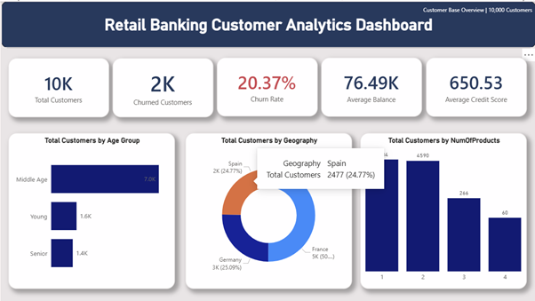
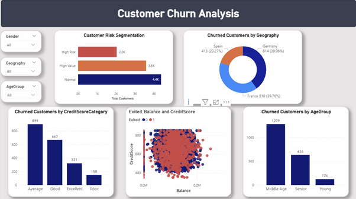

# Retail Banking Customer Churn Analytics
This project analyzes customer churn in a retail banking dataset using Power BI dashboards and a Random Forest machine learning model.
The objective is to identify customers who are likely to leave the bank and support data-driven retention strategies.

## Dashboard Preview

### Customer Overview

### Churn Analysis

### Churn Risk Prediction

## Dataset

The project uses the **Bank Customer Churn Modelling Dataset** from Kaggle.

- **Total customers:** 10,000  
- **Target variable:** `Exited`  
  - 1 = Customer churned  
  - 0 = Customer retained  

Key features include:

- CreditScore  
- Geography  
- Gender  
- Age  
- Tenure  
- Balance  
- NumOfProducts  
- IsActiveMember  
- EstimatedSalary  

## Data Preparation (Power BI)

Several transformations were applied in Power Query:

- Removed identifier columns  
  - RowNumber  
  - CustomerId  
  - Surname  

- Created segmentation features:
  - **AgeGroup** → Young, Middle Age, Senior  
  - **CreditScoreCategory** → Poor, Average, Good, Excellent  
  - **BalanceCategory** → No Balance, Low, Medium, High  

These transformations improve interpretability when analyzing churn behavior.

## Machine Learning Model
A **Random Forest Classifier** was used to estimate churn probability.

**Libraries used**
- Pandas
- NumPy
- Scikit-learn
- Matplotlib
- Seaborn

**Model configuration**
- Train/Test Split: 80/20  
- Cross Validation: 5-fold  
- n_estimators: 200  
- max_depth: 8  

Average model accuracy:
~0.82

The model generates a **churn probability score** for each customer.
These probability scores are exported and used in Power BI to classify customers into churn risk segments.

## Risk Segmentation
Customers were categorized based on predicted churn probability.

| Probability | Segment |
|-------------|---------|
| ≥ 0.565 | High Risk |
| 0.35 – 0.565 | Medium Risk |
| < 0.35 | Low Risk |

Approximately **22% of customers fall into the high-risk segment**.

## Power BI Dashboard
The dashboard consists of three pages:

**Customer Overview**
- Customer distribution by geography
- Customer demographics by age group
- Product ownership analysis

**Churn Analysis**
- Churn by geography
- Churn by age group
- Credit score analysis
- Balance vs credit score behavior

**Churn Risk Prediction**
- Customer distribution by risk level
- Average churn probability by segment
- High-risk customer identification
- Business insights for retention strategies

## Key Insights
- ~22% of customers fall into the **high-risk churn segment**
- High-risk customers have an **average churn probability of ~0.75**
- Middle-aged customers represent the **largest churn segment**
- Customers with moderate credit scores account for significant churn

These insights help banks **prioritize targeted retention campaigns**.

## Technologies Used
- Power BI  
- Python  
- Pandas  
- NumPy  
- Scikit-learn  
- Matplotlib  
- Seaborn  

## Author
**Sowdeshwar Survesha Kumaar**  
Master of Data Science — University of Queensland
